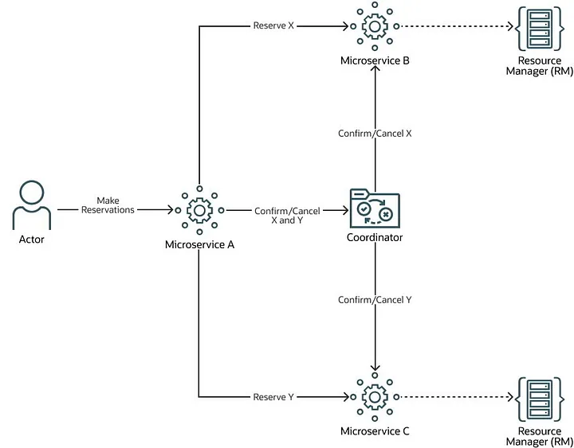

# Try-Confirm-Cancel (TCC) Compensation Matters

## Context

TCC（Try-Confirm-Cancel）是一种分布式事务管理的补偿模式，主要用于解决分布式系统中的事务一致性问题。在传统的单体应用中，事务管理通常是通过数据库的 ACID 特性来实现的。

在分布式系统中，其核心是将一个复杂事物拆解为多个步骤，每个步骤对应一个独立的服务调用或者数据库操作。每个步骤都包含三个阶段：Try 尝试；Confirm 确认；Cancel 取消。

1. TCC 的三个阶段
- **Try 阶段**：尝试执行操作，预留资源，但不最终提交事务。此阶段主要检查操作是否可行，并进行资源的预占。例如，在银行转账场景中，`Try` 阶段会检查账户余额是否足够，并冻结相应的金额。
- **Confirm 阶段**：确认操作，最终提交事务。如果所有参与方的 `Try` 阶段都成功，则执行 `Confirm` 阶段，释放预留资源并完成操作。
- **Cancel 阶段**：取消操作，回滚预留资源。如果在 `Try` 阶段有参与方失败，则执行 `Cancel` 阶段，释放预留资源，确保事务的一致性。

2. 补偿机制
TCC 模式的核心是补偿机制。在分布式环境下，可能会出现部分操作成功而部分操作失败的情况。此时，需要通过补偿操作来确保事务的一致性。例如，如果在银行转账事务中，从账户 A 转账到账户 B 的操作在 `Try` 阶段冻结了账户 A 的金额，但在 `Confirm` 阶段失败，则需要在 `Cancel` 阶段释放账户 A 的冻结金额。

3. 应用场景
- 适合跨服务长周期事务。
- 强调最终一致性，能够接受短暂不一致的系统。

## 优势

- **强一致性保证**：TCC 模式通过补偿机制确保分布式事务的强一致性。只要参与方正确实现了 `Confirm` 和 `Cancel` 操作，事务的最终状态要么是所有操作都成功，要么所有操作都回滚。
- **避免长时间锁资源**：减少长事务处理中对资源的锁定时间，提高系统的并发性能。
- **灵活性**：TCC 模式允许参与方根据具体业务需求实现补偿逻辑，具有较高的灵活性。

## 劣势

- **复杂度高-侵入性强**：开发复杂度高，需额外实现正向操作（`Try`/`Confirm`）与逆向操作（`Cancel`）的对称性。同样的，对将要接入 TCC 的业务代码有很强的侵入性。
- **性能开销**：由于需要进行三次调用（`Try`、`Confirm` 或 `Cancel`），TCC 模式会增加系统的性能开销，尤其是在网络调用较多的情况下。
- **无法保证原子性**：分布式场景下，各子事务独立提交，可能短暂出现中间状态（如部分成功、部分回滚）。

## 适用场景

|适用场景|描述|
|---|---|
|银行转账|涉及多个账户的转账操作，需要确保资金的一致性。TCC 模式可以确保转账事务要么全部成功，要么全部回滚。|
|库存预订|在电商场景中，预订库存需要确保库存的一致性。TCC 模式可以先冻结库存（`Try`），然后确认或取消预订（`Confirm` 或 `Cancel`）。|
|旅行预订|预订机票、酒店等需要协调多个服务的场景。TCC 模式可以确保所有预订要么全部成功，要么全部取消。|
|跨服务数据更新|涉及多个微服务的数据更新操作。TCC 模式可以确保数据的一致性，避免部分更新成功而部分更新失败的情况。|

## 挑战及方案

> 服务宕机：在 `Try` 阶段完成后，如果某个参与方服务宕机，无法执行 `Confirm` 或 `Cancel` 操作，导致事务无法完成。
- **超时机制**：设置事务超时时间，如果在超时时间内无法完成事务，则自动执行补偿操作。
- **监控与预警**：建立监控系统，及时发现服务宕机并进行预警，便于手动干预。
- **重试机制**：在服务恢复后，自动重试未完成的事务。
